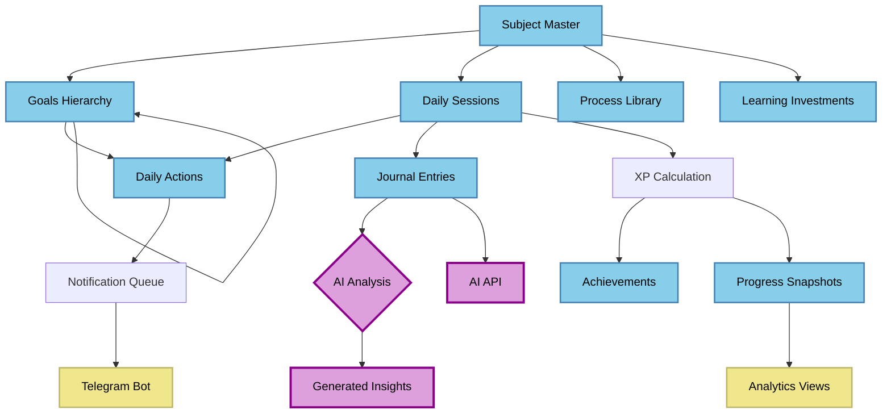
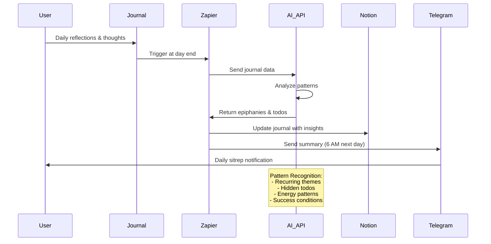
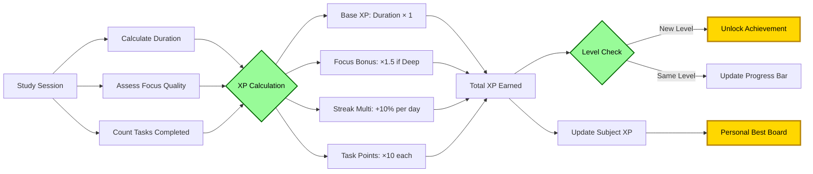
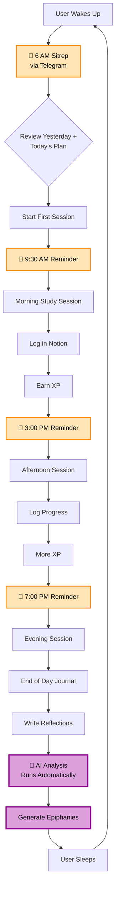
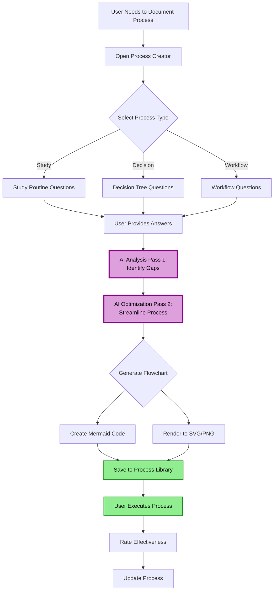
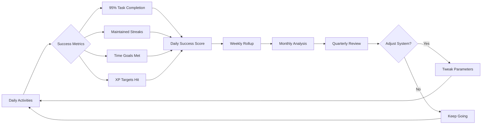
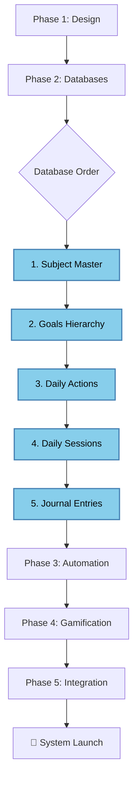

# 🔄 Project Flowchart - Notion Learning System

## Overview
Visual representation of the entire project flow from conception to completion, showing all phases, decisions, and deliverables.

---

## 📊 Master Project Flow

```mermaid
graph TB
    %% Starting Point
    Start[🚀 Project Start:<br/>Scattered Learning Tools] --> Problem[❓ Problem Definition:<br/>- Todoist Comments<br/>- Toggl Time Tracking<br/>- Manual AI Analysis]
    
    Problem --> Vision[💡 Vision:<br/>Unified Gamified<br/>Learning System]
    
    %% Phase 1
    Vision --> Phase1{📋 Phase 1:<br/>Pseudocode & Analysis}
    
    Phase1 --> Req[Requirements Gathering]
    Req --> Input1[Initial User Input]
    Input1 --> Clarify[Clarification Questions]
    Clarify --> Input2[Detailed Responses]
    
    Input2 --> Analysis[Requirements Analysis]
    Analysis --> Design{System Design}
    
    Design --> Pseudo[System Pseudocode]
    Design --> Pipeline[Process Pipeline Design]
    Design --> DBDesign[Database Architecture]
    
    Pseudo --> Schemas[Notion Schemas]
    Pipeline --> Schemas
    DBDesign --> Schemas
    
    Schemas --> Phase1Complete[✅ Phase 1 Complete<br/>All Documentation Ready]
    
    %% Phase 2
    Phase1Complete --> Phase2{🏗️ Phase 2:<br/>Foundation Setup}
    
    Phase2 --> DB1[Subject Master DB]
    Phase2 --> DB2[Goals Hierarchy DB]
    Phase2 --> DB3[Daily Sessions DB]
    Phase2 --> DB4[Daily Actions DB]
    Phase2 --> DB5[Journal Entries DB]
    
    DB1 --> Relations[Setup Relations]
    DB2 --> Relations
    DB3 --> Relations
    DB4 --> Relations
    DB5 --> Relations
    
    Relations --> TestData[Create Test Data]
    TestData --> Phase2Complete[✅ Phase 2 Complete<br/>Core Databases Ready]
    
    %% Phase 3
    Phase2Complete --> Phase3{⚙️ Phase 3:<br/>Automation Layer}
    
    Phase3 --> Formulas[Implement Formulas]
    Phase3 --> Views[Create Views]
    Phase3 --> API[Notion API Setup]
    
    Formulas --> Dashboard[Today's Dashboard]
    Views --> Dashboard
    API --> Dashboard
    
    Dashboard --> Phase3Complete[✅ Phase 3 Complete<br/>Automation Active]
    
    %% Phase 4
    Phase3Complete --> Phase4{🎮 Phase 4:<br/>Gamification}
    
    Phase4 --> XP[XP System]
    Phase4 --> Achieve[Achievements]
    Phase4 --> Visual[Progress Visuals]
    
    XP --> Gamified[Gamified Experience]
    Achieve --> Gamified
    Visual --> Gamified
    
    Gamified --> Phase4Complete[✅ Phase 4 Complete<br/>Engagement Mechanics Live]
    
    %% Phase 5
    Phase4Complete --> Phase5{🔌 Phase 5:<br/>Integration}
    
    Phase5 --> Zapier[Zapier Workflows]
    Phase5 --> Telegram[Telegram Bot]
    Phase5 --> AI[AI Integration]
    
    Zapier --> Automated[Fully Automated System]
    Telegram --> Automated
    AI --> Automated
    
    Automated --> Phase5Complete[✅ Phase 5 Complete<br/>System Fully Operational]
    
    %% Final
    Phase5Complete --> Success[🎯 Success:<br/>Unified Learning System<br/>with AI Insights]
    
    %% Styling
    classDef phaseStyle fill:#4A90E2,color:#fff,stroke:#2E5C8A,stroke-width:3px
    classDef completeStyle fill:#90EE90,color:#000,stroke:#228B22,stroke-width:3px
    classDef processStyle fill:#FFE4B5,color:#000,stroke:#FF8C00,stroke-width:2px
    
    class Phase1,Phase2,Phase3,Phase4,Phase5 phaseStyle
    class Phase1Complete,Phase2Complete,Phase3Complete,Phase4Complete,Phase5Complete,Success completeStyle
    class Req,Analysis,Design,Formulas,Views,XP,Achieve,Zapier,Telegram,AI processStyle
```

---

## 🔍 Phase 1 Detailed Flow

```mermaid
graph LR
    %% Phase 1 Detail
    Start[Phase 1 Start] --> Structure[Create Directory Structure]
    Structure --> Index[PROJECT_INDEX.md]
    Index --> Todo[MASTER_TODO.md]
    
    Todo --> Questions{User Input Process}
    Questions --> Q1[Initial Questions]
    Q1 --> A1[User Responses]
    A1 --> Q2[Follow-up Questions]
    Q2 --> A2[Clarifications]
    
    A2 --> Requirements[Requirements Analysis]
    Requirements --> Innovations{Key Innovations}
    
    Innovations --> Epiphany[AI Epiphany Engine]
    Innovations --> Process[Process Pipeline System]
    
    Epiphany --> SystemDesign[System Pseudocode]
    Process --> SystemDesign
    
    SystemDesign --> DB{Database Design}
    DB --> DB1[10 Databases Defined]
    DB --> DB2[Relations Mapped]
    DB --> DB3[Formulas Created]
    
    DB1 --> Schemas[Notion Schemas]
    DB2 --> Schemas
    DB3 --> Schemas
    
    Schemas --> Journal[Project Journal Created]
    Journal --> Complete[Phase 1 Complete]
    
    %% Styling
    classDef innovationStyle fill:#FFD700,color:#000,stroke:#B8860B,stroke-width:3px
    classDef completeStyle fill:#90EE90,color:#000,stroke:#228B22,stroke-width:3px
    
    class Epiphany,Process innovationStyle
    class Complete completeStyle
```

---

## 🗄️ Database Relationship Flow

---

## 🤖 AI Integration Flow

---

## 🎮 Gamification Flow

---

## 📱 Daily Workflow Flow

---

## 🔄 Process Pipeline Flow

---

## 📈 Success Metrics Flow

---

## 🚀 Implementation Order

---

**Last Updated**: 2025-07-04
**Purpose**: Visual guide for project implementation
**Tool**: Can be rendered in Notion using Mermaid or converted to images