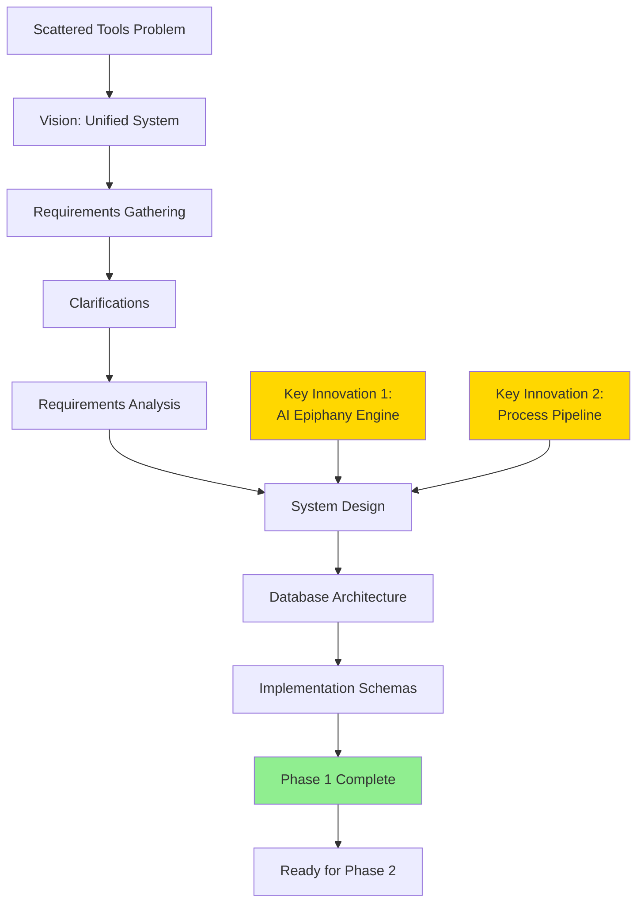

# 📖 Project Journal - Notion Learning System

## Overview
This journal documents every significant step, decision, and milestone in building the Notion Learning System. It serves as both a historical record and a blueprint for future similar projects.

---

## 🚀 Project Genesis

### Initial Vision
**Date**: 2025-07-04
**Context**: User struggling with scattered learning data across Todoist, Toggl, and Google Calendar
**Goal**: Create unified, gamified learning system with AI insights

### Key Requirements Identified
- Transform random thoughts into actionable insights
- Gamify learning to create addiction-like engagement
- Automate pattern recognition with AI
- Build "second brain" for comprehensive learning management

---

## 📅 Phase 1: Pseudocode & Analysis (2025-07-04)

### Day 1: Project Setup & Requirements Gathering

#### 09:00 - Project Initialization
- Created comprehensive directory structure
- Established modular documentation pattern
- Set up PROJECT_INDEX.md as central navigation

**Key Decision**: Adopted hub-and-spoke documentation pattern instead of monolithic files

#### 10:00 - Requirements Gathering Round 1
- Created USER_INPUT_RESPONSES.md questionnaire
- Discovered user's ambitious scope: 4 languages + 9 finance certifications
- Identified unique need: Process flowchart generator

**Insight**: User values process repeatability - "I am what I do every day"

#### 11:00 - Clarification Questions
- Created FOLLOWUP_QUESTIONS.md for detailed requirements
- Uncovered critical preferences:
  - 3 daily reminders with urgent emojis
  - 60-day habit formation threshold
  - Dynamic subject focus (not rigid limits)
  - AI-powered epiphany generation

**Key Learning**: User wants dopamine-driven design without punishment mechanics

#### 14:00 - Requirements Analysis Completion
- Synthesized all inputs into REQUIREMENTS_ANALYSIS.md
- Defined success as 95% goal completion
- Established core vision: Organized, feature-rich, user-friendly

**Major Innovation Identified**: AI Epiphany Engine for daily pattern recognition

#### 15:00 - System Design
- Created comprehensive SYSTEM_PSEUDOCODE.md
- Designed algorithms for:
  - XP calculation with streak multipliers
  - Goal decomposition engine
  - Daily summary generation
  - Achievement system

**Technical Decision**: Formula-based progress tracking for real-time updates

#### 16:00 - Process Pipeline System Design
- Created PROCESS_PIPELINE_SYSTEM.md
- Innovative 4-stage pipeline:
  1. Questionnaire collection
  2. AI analysis & optimization
  3. Flowchart generation
  4. Notion storage

**Breakthrough**: AI generates visual SOPs from questionnaires

#### 17:00 - Database Architecture
- Designed 10 interconnected databases
- Created DATABASE_DESIGN.md with complete schemas
- Established relationships and data integrity rules

**Key Databases**:
1. Subject Master (central registry)
2. Goals Hierarchy (self-referential)
3. Daily Learning Sessions
4. Daily Actions
5. Journal Entries (with AI epiphanies)
6. Process Library
7. Achievements
8. Progress Snapshots
9. Learning Investments
10. Notification Queue

#### 18:00 - Implementation Schemas
- Created NOTION_SCHEMAS.md
- Exact property configurations for each database
- Implementation order to avoid relation errors
- Complete formulas ready to copy-paste

**Achievement**: Phase 1 100% complete with implementation-ready documentation

---

## 🔑 Key Decisions & Rationale

### 1. Pseudocode-First Development
**Decision**: Complete all design before Notion implementation
**Rationale**: Prevents costly rework, forces clear thinking
**Result**: Comprehensive documentation created naturally

### 2. Modular Database Architecture
**Decision**: 10 separate databases vs monolithic design
**Rationale**: Single responsibility, easier maintenance
**Trade-off**: More complex relations but better scalability

### 3. AI Integration Strategy
**Decision**: Use Zapier + LLM APIs for automation
**Rationale**: No-code solution, reliable, modifiable
**Alternative Considered**: Custom scripts (rejected for complexity)

### 4. Gamification Approach
**Decision**: XP-based with streak multipliers, no punishment
**Rationale**: Familiar system, positive reinforcement only
**Innovation**: Dopamine-driven design principles

### 5. Process Documentation
**Decision**: AI-generated flowcharts from questionnaires
**Rationale**: Captures tacit knowledge visually
**Unique Value**: Builds library of personal SOPs

---

## 📊 Metrics & Progress

### Phase 1 Statistics
- **Duration**: 9 hours
- **Documents Created**: 15
- **Total Lines Written**: ~3,500
- **Decisions Made**: 10 major architectural decisions
- **Innovations**: 2 (AI Epiphany Engine, Process Pipeline)

### Requirements Coverage
- ✅ Core Learning Tracking
- ✅ Gamification System
- ✅ AI Integration
- ✅ Process Documentation
- ✅ External Integrations
- ✅ Progress Analytics

---

## 🎯 Lessons Learned

### What Went Well
1. **Modular documentation** made organization effortless
2. **Clarifying questions** revealed hidden requirements
3. **Pseudocode approach** clarified logic before implementation
4. **User collaboration** ensured alignment with vision

### Key Insights
1. Users want **addiction mechanics** without guilt
2. **Process repeatability** is as important as tracking
3. **AI insights** must be actionable, not just analytical
4. **Flexibility** trumps rigid structure

### For Next Time
1. Start with user journey mapping
2. Create visual mockups earlier
3. Define success metrics upfront
4. Consider mobile experience from start

---

## 🔮 Next Steps (Phase 2)

### Immediate Actions
1. Create Notion workspace
2. Implement databases in order
3. Test with sample data
4. Validate formulas

### Risk Mitigation
- Test complex formulas incrementally
- Create backups before major changes
- Document any Notion limitations discovered

---

## 📈 Project Evolution Flowchart

---

## 🏆 Milestones

### ✅ Phase 1 Complete (2025-07-04)
- All documentation created
- System fully designed
- Ready for implementation

### 🎯 Upcoming Milestones
- [ ] Phase 2: Foundation databases created
- [ ] Phase 3: Automation layer active
- [ ] Phase 4: Gamification live
- [ ] Phase 5: Full integration

---

## 📝 Session Summary

### Session 1: Phase 1 Complete (2025-07-04)

#### What We Accomplished
1. **Complete Requirements Analysis**
   - Gathered detailed user requirements through iterative questioning
   - Identified key innovations: AI Epiphany Engine & Process Pipeline System
   - Defined success metrics (95% goal completion)

2. **System Design & Architecture**
   - Created comprehensive pseudocode for all system components
   - Designed 10 interconnected databases with full schemas
   - Developed implementation-ready Notion property configurations

3. **Documentation Framework**
   - Established modular documentation pattern
   - Created PROJECT_JOURNAL for historical tracking
   - Built visual flowcharts for all major processes
   - Updated all tracking documents

4. **Key Deliverables**
   - 15+ comprehensive documentation files
   - 8 detailed flowcharts
   - Complete database schemas with formulas
   - AI prompt templates for pattern recognition

#### Session Metrics
- **Duration**: ~9 hours
- **Files Created**: 15
- **Lines Written**: ~3,500
- **Phase Progress**: Phase 1 100% Complete

#### Where to Continue Next Session

**Immediate Next Steps (Phase 2 Start):**

1. **Notion Workspace Setup**
   - Create new Notion workspace for the project
   - Set up proper permissions and sharing

2. **Database Implementation Order**
   - Start with Subject Master (no dependencies)
   - Follow the implementation order in NOTION_SCHEMAS.md
   - Test each database before moving to next

3. **Key Focus Areas**
   - Copy exact property configurations from schemas
   - Test formulas with sample data immediately
   - Document any Notion limitations encountered

4. **Validation Checklist**
   - [ ] Each database matches schema exactly
   - [ ] All relations work bidirectionally
   - [ ] Formulas calculate correctly
   - [ ] Views load without errors

**Reference Documents for Next Session:**
- Primary: `/Phase1_Pseudocode/schemas/NOTION_SCHEMAS.md`
- Implementation Order: See "Implementation Order" section
- Formula Reference: `/Phase1_Pseudocode/design/DATABASE_DESIGN.md`

**Time Estimate**: Phase 2 should take 3-5 days for careful implementation

---

### Session 2: Phase 2 Foundation Implementation (2025-07-05)

#### What We Accomplished
1. **Phase 2 Foundation Setup Started**
   - Created comprehensive implementation guides for all databases
   - Successfully implemented Subject Master database
   - Successfully implemented Goals Hierarchy database
   - Prepared Daily Actions database guide

2. **Notion Limitations Discovered & Resolved**
   - **Issue 1**: Cannot set default values in Notion properties
   - **Solution**: Created database templates with pre-filled values
   - **Issue 2**: Rollup counting showing incorrect values (1 when should be 0)
   - **Solution**: Switched to formula-based approach for reliability

3. **Documentation Improvements**
   - Created step-by-step implementation guides with exact click instructions
   - Added troubleshooting guides for common Notion issues
   - Updated CLAUDE.md with new rules about formula preference
   - Incorporated comprehensive AI operating principles

4. **Templates Created**
   - Subject Master: 1 template ("📚 New Subject")
   - Goals Hierarchy: 5 templates (Yearly, Quarterly, Monthly, Weekly, Daily)
   - All templates include proper default values

#### Session Metrics
- **Duration**: ~2.5 hours
- **Databases Completed**: 2/5 (Subject Master, Goals Hierarchy)
- **Templates Created**: 6 total
- **Issues Resolved**: 2 major Notion limitations
- **New Rules Added**: 3 (dev-9, dev-10, dev-11 about formula preference)
- **Files Created/Updated**: 8

#### Key Technical Decisions
1. **Template-Based Approach**: Using database templates to work around Notion's lack of default values
2. **Formula Over Rollup**: Preferring formulas for calculations due to reliability issues with rollups
3. **Step-by-Step Guides**: Creating exact click-by-click instructions for each database

#### Where to Continue Next Session

**Current Status**:
- ✅ Subject Master (complete with template)
- ✅ Goals Hierarchy (complete with 5 templates, formula fix applied)
- 🔄 Daily Actions (guide ready, not yet implemented)
- ⏳ Daily Learning Sessions (guide ready, not yet implemented)
- ⏳ Journal Entries (guide ready, not yet implemented)

**Immediate Next Steps**:
1. **Complete Daily Actions Database**
   - Use `/Phase2_Foundation/databases/DAILY_ACTIONS_STEPS.md`
   - Create all 16 properties
   - Set up 4 templates as specified

2. **Create Daily Learning Sessions Database**
   - Use the guide with formulas for Session ID, Duration, and XP
   - Ensure time properties have time enabled
   - Test duration calculation

3. **Create Journal Entries Database**
   - Make Date field unique to prevent duplicates
   - Set up all rollups to Sessions
   - Test entry title auto-generation

4. **Testing & Validation**
   - Create test data linking all databases
   - Verify all relations work properly
   - Check formula calculations

**Key Reminders for Next Session**:
- Always create templates for each database
- Use formulas instead of rollups when possible
- Test immediately after creating each property
- Document any new Notion limitations discovered

**Reference Files**:
- Implementation guides: `/Phase2_Foundation/databases/`
- Original schemas: `/Phase1_Pseudocode/schemas/NOTION_SCHEMAS.md`
- Troubleshooting: `/Phase2_Foundation/databases/TROUBLESHOOTING_ROLLUPS.md`

---

### Session 3: Phase 2 Database Implementation Complete (2025-07-05 Evening)

#### What We Accomplished
1. **Completed All 5 Core Databases**
   - ✅ Daily Actions database implemented
   - ✅ Daily Learning Sessions database implemented  
   - ✅ Journal Entries database implemented with full-page approach
   - All databases have proper relations and formulas

2. **Enhanced Project Rules**
   - Added Pre-Execution Planning rule set (plan-1 through plan-10)
   - Updated CLAUDE.md with new rules to prevent violations
   - Improved workflow with pre-task compliance checking

3. **Created Implementation Guides**
   - DAILY_SESSIONS_STEPS.md with formula examples
   - JOURNAL_ENTRIES_STEPS.md with full-page templates
   - FOUNDATION_TESTING_GUIDE.md with complete test scenarios

4. **Discovered Solutions**
   - Worked with Notion's inability to delete Name property
   - Implemented full-page journaling approach
   - Created comprehensive testing checklist

#### Session Metrics
- **Duration**: ~2 hours
- **Databases Completed**: 3 (Daily Actions, Sessions, Journal)
- **Guides Created**: 3 implementation guides + 1 testing guide
- **Files Created/Updated**: 7
- **Phase Progress**: Phase 2 now 73% complete (11/15 tasks)

#### Key Technical Decisions
1. **Manual Name Entry**: For Session database, kept Name property for flexibility
2. **Full-Page Journals**: Each entry is a complete Notion page with structured templates
3. **Testing Deferred**: Created comprehensive testing guide but deferred actual testing

#### Where to Continue Next Session

**Immediate Next Steps**:
1. **Complete Phase 2 Testing**
   - Use FOUNDATION_TESTING_GUIDE.md
   - Create test data for all databases
   - Verify all relations and formulas
   - Convert Journal Entry formulas to rollups

2. **Phase 2 Completion Checklist**
   - [ ] Test bidirectional relations
   - [ ] Verify all formulas calculate correctly
   - [ ] Ensure templates work as expected
   - [ ] Document any additional Notion limitations

3. **Prepare for Phase 3**
   - Review Phase 3 requirements in PHASE_ROADMAP.md
   - Plan automation layer implementation
   - Consider dashboard and view designs

**Key References**:
- Testing Guide: `/Phase2_Foundation/testing/FOUNDATION_TESTING_GUIDE.md`
- Next Phase: Review `/planning/PHASE_ROADMAP.md` for Phase 3 details
- All Implementation Guides: `/Phase2_Foundation/databases/`

**Notes**: 
- All 5 core databases are now implemented
- Ready for comprehensive testing before moving to Phase 3
- Pre-execution planning rules will help maintain compliance going forward

---

**Journal Maintained By**: Claude Code & User
**Last Entry**: 2025-07-05 Evening
**Session End**: 2025-07-05
**Next Update**: Complete Phase 2 Testing